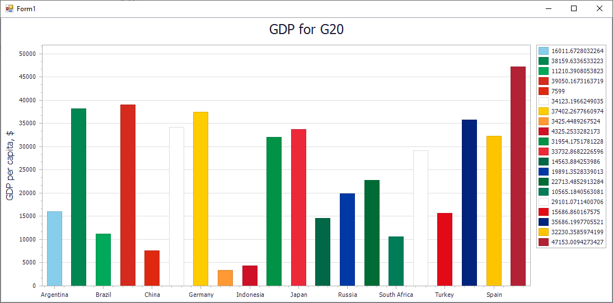

<!-- default badges list -->

<!-- default badges end -->

# WinForms Chart - How to Colorize Charts with the Color Object Colorizer

This example demonstrates how to colorize the GDP bar chart by one of the country's national colors with the Color Object Colorizer.

To use the Color Object Colorizer, create a [ColorObjectColorizer](https://docs.devexpress.com/CoreLibraries/DevExpress.XtraCharts.ColorObjectColorizer) object and assign it to the [SeriesViewBase.Colorizer](https://docs.devexpress.com/CoreLibraries/DevExpress.XtraCharts.SeriesViewBase.Colorizer) property. 

## Files to Review

* [Form1.cs](./CS/ColorObjectColorizerExample/Form1.cs) (VB: [Form1.vb](./VB/ColorObjectColorizerExample/Form1.vb))

## Documentation

* [Series Colorizer](https://docs.devexpress.com/WindowsForms/120046/controls-and-libraries/chart-control/series/series-colorizer)

<!-- feedback -->
## Does this example address your development requirements/objectives?

 

(you will be redirected to DevExpress.com to submit your response)
<!-- feedback end -->
